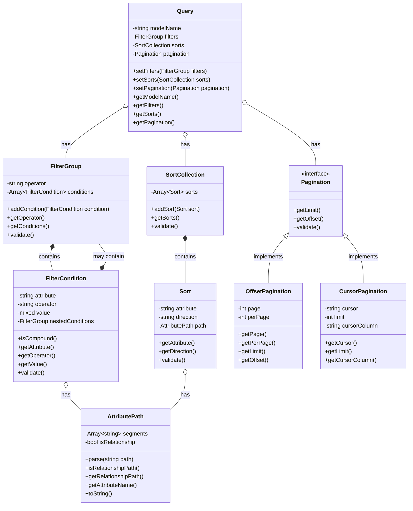

```mermaid
classDiagram
    class Query {
        -string modelName
        -FilterGroup filters
        -SortCollection sorts
        -Pagination pagination
        +setFilters(FilterGroup filters)
        +setSorts(SortCollection sorts)
        +setPagination(Pagination pagination)
        +getModelName()
        +getFilters()
        +getSorts()
        +getPagination()
    }

    class FilterGroup {
        -string operator
        -Array~FilterCondition~ conditions
        +addCondition(FilterCondition condition)
        +getOperator()
        +getConditions()
        +validate()
    }

    class FilterCondition {
        -string attribute
        -string operator
        -mixed value
        -FilterGroup nestedConditions
        +isCompound()
        +getAttribute()
        +getOperator()
        +getValue()
        +validate()
    }

    class AttributePath {
        -Array~string~ segments
        -bool isRelationship
        +parse(string path)
        +isRelationshipPath()
        +getRelationshipPath()
        +getAttributeName()
        +toString()
    }

    class SortCollection {
        -Array~Sort~ sorts
        +addSort(Sort sort)
        +getSorts()
        +validate()
    }

    class Sort {
        -string attribute
        -string direction
        -AttributePath path
        +getAttribute()
        +getDirection()
        +validate()
    }

    class Pagination {
        <<interface>>
        +getLimit()
        +getOffset()
        +validate()
    }

    class OffsetPagination {
        -int page
        -int perPage
        +getPage()
        +getPerPage()
        +getLimit()
        +getOffset()
    }

    class CursorPagination {
        -string cursor
        -int limit
        -string cursorColumn
        +getCursor()
        +getLimit()
        +getCursorColumn()
    }

    Query o-- FilterGroup : has
    Query o-- SortCollection : has
    Query o-- Pagination : has
    FilterGroup *-- FilterCondition : contains
    FilterCondition *-- FilterGroup : may contain
    FilterCondition o-- AttributePath : has
    Sort o-- AttributePath : has
    Pagination <|-- OffsetPagination : implements
    Pagination <|-- CursorPagination : implements
    SortCollection *-- Sort : contains
```
